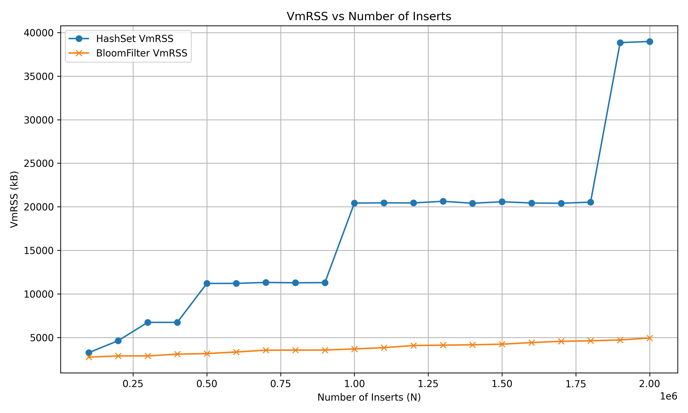
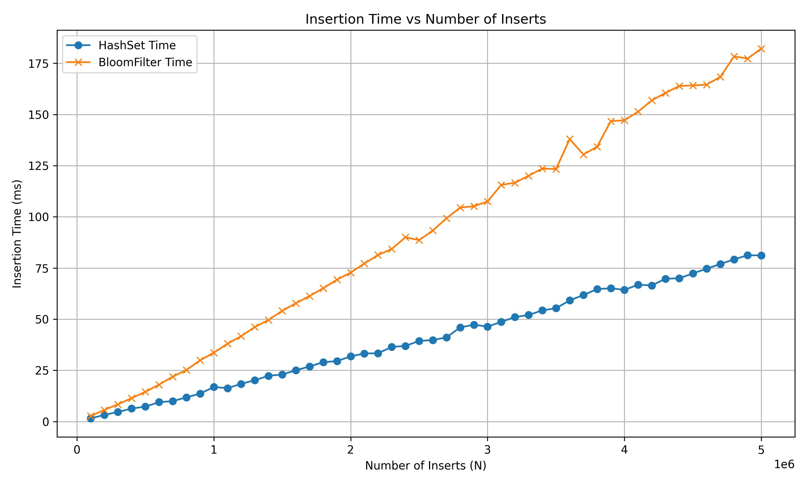

**Project Bi-Weekly Update: Enhanced Memory & Time Benchmarking with HashSet vs BloomFilter**

**Student:** Jonathan Ami  
**Date:** April 4, 2025

---

### **Planned Activities:**

- Create new benchmarking scripts to isolate and profile memory and time usage
- Chart results from `proc_benchmark.sh` and `insertion_time_benchmark.sh`
- Modify packet filter code to simulate client server architecture with a working packet filter

---

### **Progress Update:**

#### **New Testing Methods:**

Two new benchmarking tools were introduced:

1. `insertion_time_benchmark.sh`: Runs time-based insertion tests from 100k to 1M entries using both data structures, writing results to CSV.
2. `proc_benchmark.sh`: Profiles `/proc/<pid>/status` data after 1-second runs to capture memory usage for Bloom Filter and HashSet, exporting to `bloomfilter_mem.csv` and `hashset_mem.csv`.

These tools allow for clearer, head-to-head performance tracking with consistent testing conditions and controlled FP rates.

---

### **Memory Benchmark Results:**

**VmRSS (Resident Memory)** showed expected trends as insertions scaled:

| N    | VmRSS (KB) - HashSet | VmRSS (KB) - BloomFilter |
| ---- | -------------------- | ------------------------ |
| 100k | 3244                 | 2740                     |
| 1M   | 20428                | 3680                     |
| 2M   | 38976                | 4932                     |

**Observations:**

- At 100k insertions, memory usage is relatively close.
- At 1M, the HashSet uses over 5.5x the memory of the Bloom Filter.
- By 2M insertions, that difference increases to nearly 8x, confirming the Bloom Filter’s substantial memory efficiency.

---

### **Insertion Time Benchmark Results:**

Insertion timing, recorded using the `insertion_time_benchmark.sh`, also showed favorable results for BloomFilter:

| N    | Time (ms) - HashSet | Time (ms) - BloomFilter |
| ---- | ------------------- | ----------------------- |
| 100k | ~1.47               | ~2.69                   |
| 5M   | ~81.10              | ~182.17                 |

**Analysis:**

- BloomFilter is approximetly 2x slower than the hashset
- Likely cuased by multiple hashfunctions and bit manipultaion overhead

---

### **Repository Changes:**

- Added `benchmark_results/` folder for all generated CSV data.
- New `.sh` scripts to handle batch timing and `/proc` memory capture.
- Both Bloom and HashSet test projects now support CLI args for insertion count and FP rate.
- Makefile targets updated for reproducible builds.

---

### **Next Steps:**

- Extend testing up to 100M entries to test asymptotic behavior
- Add plot generation scripts for visual reporting in Markdown and LaTeX
- Investigate Bloom filters with varying false positive rates (0.01, 0.001, 0.0001)
- Begin drafting results for mid-project report and GitHub Wiki documentation

---

### **References:**

1. Bloom Filter Theory & Practice. IEEE Communications Surveys, 2023.
